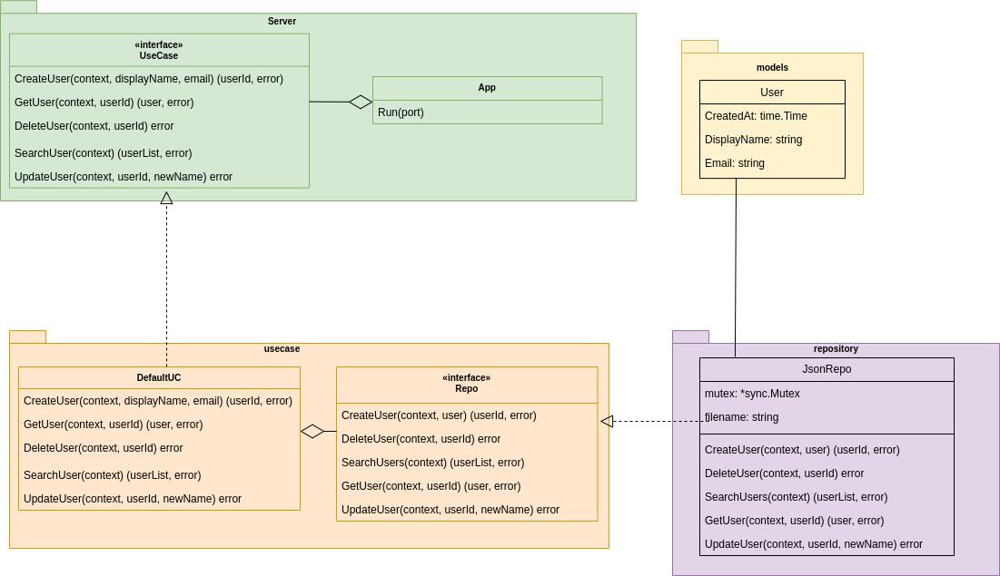

Проект написан с соблюдением принципов чистой архитектуры.
Приложение раздлено на слои:

- Бизнес модель (models)
- Бизнес логика (usecase)
- Репозиторий (repository)

Слои взаимодействую друг с другом посредством интерфейсов, благодаря
чему код получается слабосвязным, а его отдельные компоненты легко заменяемы
(можно реализовать интерфейс репозитория для работы с БД и заменить хранение в
json на хранение в БД проинициализировав поле repo новой структурой).

**Диаграмма классов:**

Так же исправлен ряд ошибок, которые я встретил в исходном коде:

- Если файл .json был пустым, то при попытке добавлени пользователя происходила паника в горутине
  обрабатывающей запрос, т.к. UserList (map[string]User) был равен nil. Теперь пустой .json файл означает,
  что хранилище пустое
- Обработаны прогинорированные ошибки
- При обработке запросов delete_user и update_user неправильно записывался статус в ответ:
  `render.Status(r, http.StatusNoContent)`. Такой код только добавляет в контекст запроса значение по ключу
  Status, но добавление статуса в заголовок ответа происходит только при вызове метода
  `Render(w http.ResponseWriter, r *http.Request, v Renderer)`, поэтому я добавил заголовок в ответ через метод
  интерфейса `http.ResponseWriter` `WriteHeader(statusCode int)`

В дальнейшем я добавил бы проверку email регулярными выражениями